# YazLabProje2  
### Sosyal Ağ Analizi Uygulaması

**Kocaeli Üniversitesi**  
**Teknoloji Fakültesi – Bilişim Sistemleri Mühendisliği**  
**Yazılım Geliştirme Laboratuvarı I | Proje 2**

---

## Proje Bilgileri

**Proje Adı:** Sosyal Ağ Analizi Uygulaması  
**Ders:** Yazılım Geliştirme Laboratuvarı I  
**Akademik Yıl:** 2025 – 2026  

---

## Ekip Üyeleri

| Ad Soyad | Öğrenci No |
|---------|------------|
| Şenay Cengiz | 231307027 |
| Yasemin Atiş | 231307023 |

---

## 2. Giriş
Bu proje kapsamında, kullanıcıların düğüm (node) ve aralarındaki ilişkilerin kenar (edge) olarak temsil edildiği bir Sosyal Ağ Analizi Uygulaması geliştirilmiştir. Uygulama, sosyal ağı dinamik olarak oluşturabilmekte, farklı algoritmalar yardımıyla ağ üzerinde analizler yapabilmekte ve sonuçları görsel olarak sunabilmektedir.

 Projenin Amaçları

Bu projenin temel amaçları şunlardır:
	•	Sosyal ağ yapısının graf veri yapısı ile modellenmesi
	•	BFS, DFS, Dijkstra, A*, bağlı bileşenler ve merkezilik gibi graf algoritmalarının uygulanması
	•	Dinamik ağırlık hesaplama yöntemiyle gerçekçi kenar maliyetlerinin oluşturulması
	•	Welsh–Powell algoritması ile graf renklendirme yapılarak toplulukların görselleştirilmesi
	•	Nesne yönelimli tasarım prensiplerine uygun, modüler ve sürdürülebilir bir yazılım geliştirilmesi
	•	Algoritma sonuçlarının tablo, renk ve görsel grafikler ile kullanıcıya sunulması

Bu proje sayesinde grafik yapıları, algoritma analizi, nesne yönelimli programlama ve görselleştirme konularında uygulamalı deneyim kazanılması hedeflenmiştir.
## 3. Gerçeklenen Algoritmalar 

Bu projede sosyal ağ yapısının analiz edilebilmesi amacıyla çeşitli grafik algoritmaları
gerçeklenmiştir. Aşağıdaki tabloda, uygulamada kullanılan algoritmalar, kullanım amaçları
ve zaman karmaşıklıkları özetlenmiştir.

| Algoritma | Kullanım Amacı | Zaman Karmaşıklığı |
|----------|---------------|-------------------|
| BFS (Breadth First Search) | Bir düğümden erişilebilen tüm düğümlerin seviye seviye bulunması | O(V + E) |
| DFS (Depth First Search) | Grafın derinlemesine gezilerek erişilebilir düğümlerin tespiti | O(V + E) |
| Dijkstra | Kenar ağırlıklarını dikkate alarak iki düğüm arasındaki en kısa yolun bulunması | O((V + E) log V) |
| A* (A-Star) | Sezgisel yaklaşım ile en kısa yolun daha hızlı hesaplanması | O((V + E) log V) |
| Bağlı Bileşenler | Grafın kaç ayrı alt topluluktan oluştuğunun tespit edilmesi | O(V + E) |
| Degree Centrality | En yüksek dereceye sahip (en etkili) düğümlerin belirlenmesi | O(V) |
| Welsh–Powell | Komşu düğümlerin farklı renklerle boyanmasını sağlayan graf renklendirme | O(V²) |

## 3.1. Breadth First Search (BFS)

Amaç

Breadth First Search (BFS) algoritması, graf üzerinde seçilen bir başlangıç düğümünden itibaren erişilebilen tüm düğümlerin seviye seviye tespit edilmesi amacıyla kullanılmıştır. Sosyal ağ bağlamında BFS, bir kullanıcının doğrudan ve dolaylı olarak bağlantılı olduğu tüm kullanıcıları belirlemek için uygulanmıştır.

⸻

Çalışma Mantığı

BFS algoritması, grafı katmanlar halinde dolaşır ve bu işlem sırasında kuyruk (queue) veri yapısını kullanır.

Algoritmanın temel adımları şu şekildedir:  

	1.	Başlangıç düğümü seçilir ve kuyruğa eklenir.
	2.	Düğüm ziyaret edildi olarak işaretlenir.
	3.	Kuyruktan çıkarılan düğümün tüm komşuları kontrol edilir.
	4.	Daha önce ziyaret edilmemiş komşular kuyruğa eklenir.
	5.	Kuyruk boşalana kadar işlem devam eder.

Bu yöntem sayesinde graf, başlangıç düğümüne olan en kısa adım mesafesine göre gezilmiş olur.
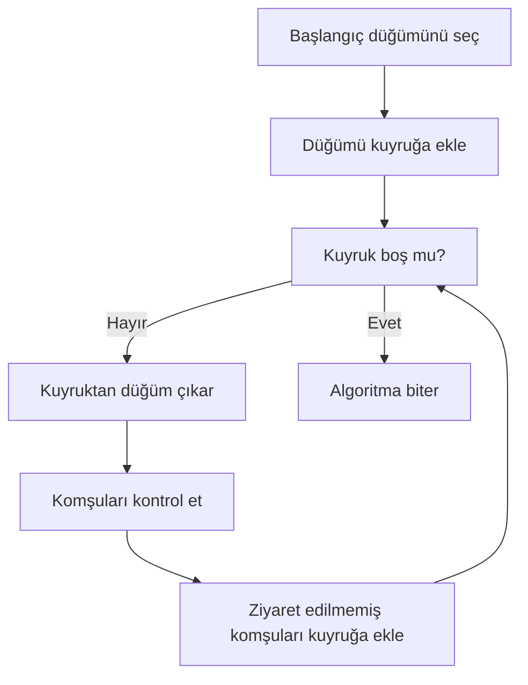
Zaman Karmaşıklığı
	•	Zaman Karmaşıklığı:
O(V + E)

Burada:
	•	V: Graf üzerindeki düğüm sayısı
	•	E: Graf üzerindeki kenar sayısı

BFS algoritması, her düğümü ve kenarı en fazla bir kez ziyaret ettiği için verimli bir algoritmadır.

⸻

Projede Kullanımı

Bu projede BFS algoritması:  

	•	Kullanıcı tarafından seçilen bir düğümden başlanarak,  
  
	•	Erişilebilen tüm kullanıcıların tespit edilmesi,   
  
	•	Sonuçların liste ve tablo formatında gösterilmesi
amacıyla kullanılmıştır. Ayrıca algoritmanın çalışma süresi ölçülerek performans analizlerinde değerlendirilmiştir.

## 3.2. Depth First Search (DFS)

Amaç

Depth First Search (DFS) algoritması, graf üzerinde seçilen bir başlangıç düğümünden
itibaren derinlemesine ilerleyerek erişilebilir tüm düğümlerin tespit edilmesi
amacıyla kullanılmıştır. DFS, sosyal ağ yapısının daha ayrıntılı biçimde keşfedilmesini
sağlamaktadır.

⸻

Çalışma Mantığı

DFS algoritması, bir düğümden başlayarak mümkün olduğunca derinlere inmeyi
hedefler. Bir yol tamamen gezildikten sonra geri dönülerek diğer yollar keşfedilir.
Bu algoritma, yığın (stack) yapısı veya özyineleme (recursive) yaklaşımı ile
gerçekleştirilebilir.

Algoritmanın temel adımları şu şekildedir:  

	1.	Başlangıç düğümü seçilir ve ziyaret edildi olarak işaretlenir.
	2.	Düğümün ziyaret edilmemiş bir komşusu varsa bu düğüme geçilir.
	3.	Bu işlem, ziyaret edilecek komşu kalmayana kadar devam eder.
	4.	Ziyaret edilecek düğüm kalmadığında algoritma sonlanır.

  ```mermaid
flowchart TD
    A[Başlangıç düğümünü seç] --> B[Düğümü ziyaret edildi olarak işaretle]
    B --> C[Ziyaret edilmemiş komşu var mı?]
    C -- Evet --> D[Komşu düğüme git]
    D --> B
    C -- Hayır --> E[Geri dön / Algoritma biter]
```
Zaman Karmaşıklığı
	•	Zaman Karmaşıklığı: O(V + E)

Burada:
	•	V: Graf üzerindeki düğüm sayısı
	•	E: Graf üzerindeki kenar sayısı

DFS algoritması da BFS gibi her düğümü ve kenarı en fazla bir kez ziyaret etmektedir.

⸻

Projede Kullanımı

Bu projede DFS algoritması:  

	•	Seçilen bir düğümden erişilebilen kullanıcıların tespit edilmesi,
	•	Graf yapısının derinlemesine analiz edilmesi,
	•	BFS algoritması ile karşılaştırmalı sonuçlar elde edilmesi

amacıyla kullanılmıştır. 
 ## 3.3. Dijkstra Algoritması

### Amaç

Dijkstra algoritması, graf üzerindeki **kenar ağırlıklarını dikkate alarak**
iki düğüm arasındaki **en kısa yolun bulunması** amacıyla kullanılmıştır.
Sosyal ağ bağlamında bu algoritma, kullanıcılar arasındaki en düşük maliyetli
(etkileşim, benzerlik vb.) bağlantı yolunun hesaplanmasını sağlar.

---

### Çalışma Mantığı

Dijkstra algoritması, başlangıç düğümünden itibaren tüm düğümlere olan
en kısa mesafeleri kademeli olarak hesaplar. Algoritma, her adımda
henüz işlenmemiş düğümler arasından **en küçük geçici mesafeye sahip**
olan düğümü seçer ve bu düğüm üzerinden komşuların mesafelerini günceller.

Bu projede Dijkstra algoritması şu adımlar ile uygulanmıştır:

1. Başlangıç düğümünün mesafesi 0 olarak atanır, diğer düğümlerin mesafesi sonsuz kabul edilir.
2. En küçük mesafeye sahip düğüm seçilir.
3. Seçilen düğümün komşuları için yeni mesafe değerleri hesaplanır.
4. Daha kısa bir yol bulunursa mesafe güncellenir.
5. Tüm düğümler işlenene veya hedef düğüme ulaşılana kadar işlem devam eder.

---

### Akış Diyagramı (Mermaid)

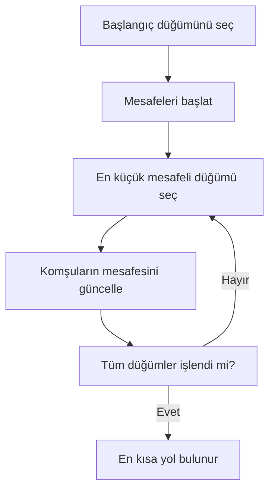
Zaman Karmaşıklığı
	•	Zaman Karmaşıklığı: O((V + E) log V) 
  
Öncelik kuyruğu (priority queue) kullanılması sayesinde algoritma,
orta ölçekli graflarda makul sürelerde çalışmaktadır.

⸻

Projede Kullanımı

Bu projede Dijkstra algoritması:  

	•	Kullanıcı tarafından seçilen iki düğüm arasındaki en kısa yolun bulunması,
	•	Kenar maliyetlerinin dinamik ağırlık hesaplama formülü ile belirlenmesi,
	•	Elde edilen yolun görsel olarak vurgulanması ve tablo halinde sunulması

amacıyla kullanılmıştır.
## 3.4. A* (A-Star) Algoritması

### Amaç

A* (A-Star) algoritması, iki düğüm arasındaki **en kısa yolun daha verimli
şekilde bulunması** amacıyla kullanılmıştır. A* algoritması, Dijkstra
algoritmasına ek olarak hedef düğüme olan **tahmini uzaklığı (heuristic)**
da dikkate alarak arama sürecini yönlendirir.

Bu sayede özellikle orta ölçekli graflarda daha hızlı sonuçlar elde edilmesi
amaçlanmıştır.

---

### Çalışma Mantığı

A* algoritması, her düğüm için iki değeri birlikte değerlendirir:

- **g(n):** Başlangıç düğümünden mevcut düğüme kadar olan gerçek maliyet  
- **h(n):** Mevcut düğümden hedef düğüme olan tahmini maliyet (heuristic)

Toplam maliyet şu şekilde hesaplanır:  
f(n) = g(n) + h(n)
Algoritmanın temel adımları şu şekildedir:

1. Başlangıç düğümü açık listeye eklenir.
2. Açık listedeki en düşük f(n) değerine sahip düğüm seçilir.
3. Seçilen düğümün komşuları değerlendirilir.
4. Daha düşük maliyetli bir yol bulunursa düğüm bilgileri güncellenir.
5. Hedef düğüme ulaşıldığında algoritma sonlanır.

---

### Akış Diyagramı (Mermaid)

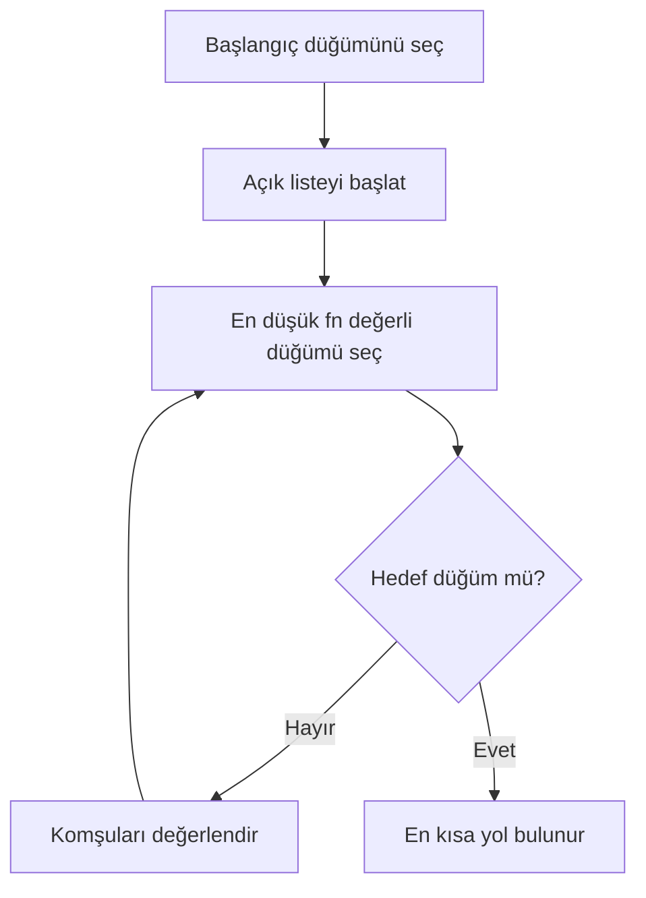
Zaman Karmaşıklığı
	•	Zaman Karmaşıklığı: O((V + E) log V)

A* algoritmasının karmaşıklığı kullanılan heuristic fonksiyonun
başarısına bağlıdır. Uygun bir heuristic seçildiğinde,
Dijkstra algoritmasına göre daha az düğüm ziyaret edilir.

⸻

Projede Kullanımı

Bu projede A* algoritması:  

	•	İki kullanıcı arasındaki en kısa yolun bulunması,
	•	Dinamik olarak hesaplanan kenar ağırlıkları ile çalışılması,
	•	Dijkstra algoritması ile performans karşılaştırması yapılması
amacıyla kullanılmıştır.

## 3.5. Bağlı Bileşenler (Connected Components)

### Amaç

Bağlı bileşenler analizi, grafın **kaç ayrı parçadan (alt topluluktan)** oluştuğunu
tespit etmek amacıyla kullanılmıştır. Sosyal ağ bağlamında bu yöntem, birbiriyle
bağlantılı kullanıcı gruplarını (toplulukları) ve ağdan kopuk yapıdaki kullanıcı
kümelerini ortaya çıkarmayı sağlar.

---

### Çalışma Mantığı

Bağlı bileşenleri bulmak için graf üzerinde dolaşma yapılır. Temel yaklaşım:

1. Tüm düğümler "ziyaret edilmedi" olarak işaretlenir.
2. Ziyaret edilmemiş bir düğüm seçilir ve bu düğümden BFS/DFS başlatılır.
3. Dolaşma sırasında erişilen tüm düğümler **aynı bileşene** atanır.
4. Graf üzerinde ziyaret edilmemiş düğüm kalmayana kadar işlem tekrarlanır.
5. Elde edilen her grup, grafın bir bağlı bileşenini temsil eder.

Bu projede bağlı bileşen bulma işleminde BFS/DFS yaklaşımı kullanılarak
bileşenler tespit edilmiştir.

---

### Akış Diyagramı (Mermaid)

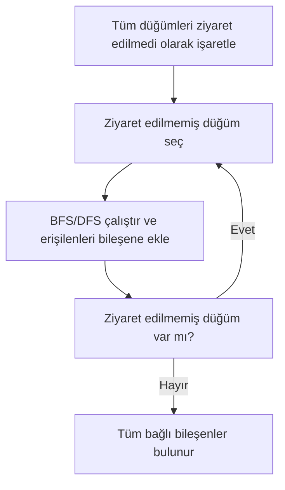
Zaman Karmaşıklığı
	•	Zaman Karmaşıklığı: O(V + E)

Her düğüm ve kenar en fazla bir kez ziyaret edildiğinden bağlı bileşenlerin
bulunması verimli bir şekilde gerçekleştirilmektedir.

⸻

Projede Kullanımı

Bu projede bağlı bileşenler:
	•	Sosyal ağın kaç ayrı topluluktan oluştuğunun belirlenmesi,
	•	Her bileşenin görsel olarak ayrıştırılması (renk/etiket),
	•	Ayrık toplulukların kullanıcıya raporlanması

amacıyla kullanılmıştır.
## 3.6. Degree Centrality (Derece Merkeziliği)

### Amaç

Degree Centrality, her düğümün sahip olduğu bağlantı (kenar) sayısını
hesaplayarak **en etkili kullanıcıların** belirlenmesi amacıyla kullanılmıştır.
Sosyal ağ bağlamında, daha fazla bağlantıya sahip kullanıcıların ağ üzerinde
daha merkezi bir rol oynadığı kabul edilir.

---

### Çalışma Mantığı

Degree Centrality hesaplaması şu adımlarla gerçekleştirilir:

1. Graf üzerindeki her düğüm için bağlantı sayısı (derece) hesaplanır.
2. Hesaplanan derece değerleri saklanır.
3. Düğümler derece değerlerine göre sıralanır.
4. En yüksek dereceye sahip düğümler (ilk 5) belirlenir.

Bu yöntem, ağırlık veya yol hesabı yapmadan doğrudan bağlantı yoğunluğunu
ölçmeye dayanır.

---

### Akış Diyagramı (Mermaid)

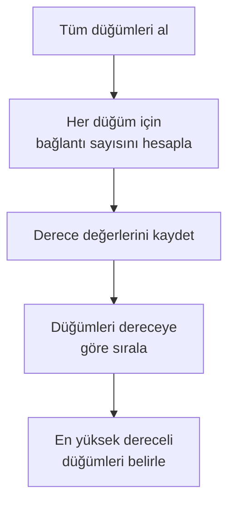
Zaman Karmaşıklığı
	•	Zaman Karmaşıklığı: O(V)

Burada:
	•	V: Düğüm sayısı

Her düğümün derecesi tek bir geçişte hesaplandığı için algoritma oldukça
verimli çalışmaktadır.

⸻

Projede Kullanımı

Bu projede Degree Centrality:  

	•	Her kullanıcının derece değerinin hesaplanması,
	•	En yüksek dereceye sahip ilk 5 kullanıcının tablo halinde gösterilmesi,
	•	Sosyal ağdaki en etkili kullanıcıların belirlenmesi
amacıyla kullanılmıştır.

## 3.7. Welsh–Powell Graf Renklendirme Algoritması

### Amaç

Welsh–Powell algoritması, graf üzerindeki **komşu düğümlerin farklı
renklerle boyanmasını** sağlamak amacıyla kullanılmıştır. Bu algoritma,
özellikle ayrık toplulukların görsel olarak ayırt edilmesini kolaylaştırır.

---

### Çalışma Mantığı

Welsh–Powell algoritmasının temel çalışma adımları şu şekildedir:

1. Tüm düğümler derece değerlerine göre azalan sırada dizilir.
2. İlk düğüme ilk renk atanır.
3. Komşu olmayan düğümlere aynı renk atanır.
4. Boyanamayan düğümler için yeni renkler kullanılır.
5. Tüm düğümler renklendirilene kadar işlem devam eder.

Bu yaklaşım, grafın minimum renk sayısına yakın bir çözüm üretmeyi hedefler.

---

### Akış Diyagramı (Mermaid)

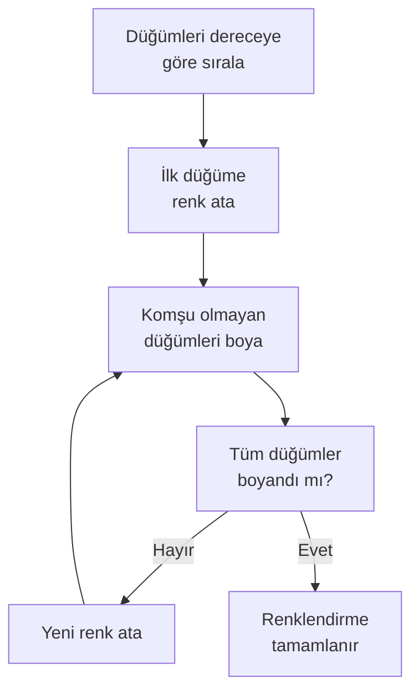
Zaman Karmaşıklığı
	•	Zaman Karmaşıklığı: O(V²)

Burada:
	•	V: Düğüm sayısı

Düğümler arası komşuluk kontrolleri nedeniyle algoritmanın karmaşıklığı
kare mertebesindedir.

⸻

Projede Kullanımı

Bu projede Welsh–Powell algoritması:  

	•	Ayrık toplulukların farklı renklerle görselleştirilmesi,
	•	Komşu düğümlerin aynı renge boyanmasının engellenmesi,
	•	Renklendirme sonuçlarının tablo ve grafik olarak sunulması

amacıyla kullanılmıştır.

## 4. Projenin Sınıf Yapısının ve Modüllerin Mermaid ile Gösterilmesi ve İşlevlerin Açıklanması

Bu projede geliştirilen Sosyal Ağ Analizi Uygulaması, nesne yönelimli programlama (OOP) prensiplerine uygun olarak tasarlanmış ve modüler bir mimari ile gerçeklenmiştir. Sistem; veri modeli, algoritmalar, dosya işlemleri, performans ölçümü ve kullanıcı arayüzü olmak üzere birbirinden ayrılmış ancak birbiriyle ilişkili modüllerden oluşmaktadır.

Bu bölümde, uygulamanın sınıf yapısı, modüller arasındaki ilişkiler ve her bir bileşenin üstlendiği görevler detaylı olarak açıklanmıştır.

---

### 4.1. Genel Mimari Yapı

Uygulama aşağıdaki temel katmanlardan oluşmaktadır:

- **Model Katmanı:**  
  Sosyal ağın temelini oluşturan düğüm (Node), kenar (Edge) ve graf (Graph) yapıları bu katmanda yer almaktadır.

- **Algoritma Katmanı:**  
  BFS, DFS, Dijkstra, A*, Connected Components, Degree Centrality ve Welsh–Powell algoritmaları bu katmanda gerçekleştirilmiştir.

- **Dosya İşlemleri Katmanı:**  
  Graf verilerinin CSV ve JSON formatlarında içe ve dışa aktarılmasını sağlayan modülleri içerir.

- **Performans Ölçüm Katmanı:**  
  Algoritmaların çalışma sürelerini ölçerek kullanıcı arayüzünde tablo halinde sunar.

- **Kullanıcı Arayüzü Katmanı:**  
  JavaFX kullanılarak geliştirilen bu katman, kullanıcı ile sistem arasındaki etkileşimi sağlar.

---

### 4.2. Temel Sınıflar ve Görevleri

#### Node Sınıfı
Node sınıfı, sosyal ağdaki her bir kullanıcıyı temsil etmektedir.  
Her Node nesnesi aşağıdaki özelliklere sahiptir:
- Benzersiz düğüm kimliği (id)
- Canvas üzerinde görselleştirme için konum bilgileri (x, y)
- Aktiflik değeri
- Etkileşim sayısı

Bu bilgiler, dinamik ağırlık hesaplamasında ve merkezilik analizlerinde kullanılmaktadır.

#### Edge Sınıfı
Edge sınıfı, iki Node arasındaki ilişkiyi temsil eder.  
Kenarlar yönsüzdür ve ağırlıklıdır. Kenar ağırlıkları sabit değildir; düğümlerin sayısal özelliklerine bağlı olarak dinamik şekilde hesaplanmaktadır.

#### Graph Sınıfı
Graph sınıfı, uygulamanın merkezinde yer alan ana veri yapısıdır.  
Tüm düğümler ve kenarlar bu sınıf içerisinde tutulur. Graf, komşuluk listesi yaklaşımı ile yönetilmektedir.

Graph sınıfının temel sorumlulukları:
- Düğüm ekleme, silme ve güncelleme
- Kenar ekleme ve silme
- Komşuluk bilgilerini yönetme
- Algoritmalara gerekli veri yapısını sağlama

---

### 4.3. Algoritma Sınıfları ve İşlevleri

#### BFS ve DFS Algoritmaları
Bu algoritmalar, seçilen bir başlangıç düğümünden erişilebilen tüm düğümleri bulmak amacıyla kullanılmıştır.

- **BFS (Breadth-First Search):**  
  Düğümleri katman katman gezerek erişilebilir kullanıcıları listeler.

- **DFS (Depth-First Search):**  
  Düğümleri derinlik öncelikli olarak gezerek erişilebilir kullanıcıları farklı bir sırada listeler.

Her iki algoritma da sosyal ağdaki bağlantı yapısını analiz etmek için kullanılmıştır.

#### Dijkstra ve A* Algoritmaları
Bu algoritmalar, iki düğüm arasındaki en kısa yolu bulmak amacıyla kullanılmıştır.

- **Dijkstra Algoritması:**  
  Tüm kenar ağırlıklarını dikkate alarak en düşük maliyetli yolu hesaplar.

- **A* Algoritması:**  
  Sezgisel (heuristic) yaklaşım kullanarak en kısa yolu daha verimli şekilde bulmayı hedefler.

Her iki algoritmada da kenar maliyetleri, dinamik ağırlık hesaplama modülü tarafından üretilen değerlerdir.

#### Connected Components Algoritması
Bu algoritma, grafın kaç adet bağlı bileşenden (ayrık topluluk) oluştuğunu tespit etmek için kullanılmıştır.  
Her bağlı bileşen, sosyal ağ içerisindeki ayrı bir topluluğu temsil etmektedir.

#### Degree Centrality Algoritması
Degree Centrality algoritması, her düğümün sahip olduğu bağlantı sayısını hesaplayarak ağ içerisindeki en etkili kullanıcıları belirler.  
Bu proje kapsamında, en yüksek dereceye sahip 5 düğüm tablo halinde kullanıcıya sunulmuştur.

#### Welsh–Powell Graf Renklendirme Algoritması
Welsh–Powell algoritması, graf renklendirme problemi için kullanılmıştır.  
Amaç, komşu düğümlerin aynı renkte olmamasını sağlayarak grafın görsel olarak ayrıştırılmasını sağlamaktır.  
Renklendirme sonuçları hem tablo hem de canvas üzerinde görsel olarak gösterilmiştir.

---

### 4.4. Dosya İşlemleri ve Performans Ölçüm Sınıfları

Graf verilerinin kalıcı hale getirilmesi amacıyla CSV ve JSON formatlarında içe ve dışa aktarım işlemleri gerçekleştirilmiştir. Bu sayede uygulama kapatılıp tekrar açıldığında aynı veri seti yeniden yüklenebilmektedir.

Ayrıca her algoritmanın çalışma süresi milisaniye (ms) cinsinden ölçülmüş ve kullanıcı arayüzünde yer alan **Performans (ms)** tablosunda gösterilmiştir. Bu yapı, algoritmaların verimliliklerinin karşılaştırılmasını mümkün kılmaktadır.

---

### 4.5. Sınıf Yapısının Mermaid Diyagramı ile Gösterimi

Aşağıda uygulamanın temel sınıflarını ve aralarındaki ilişkileri gösteren Mermaid sınıf diyagramı verilmiştir.

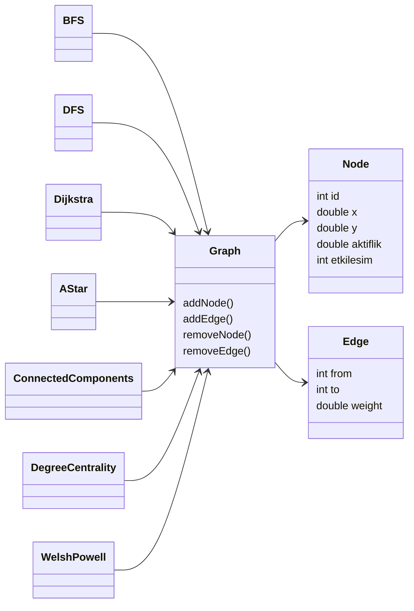

## 5. Uygulamaya Ait Açıklamalar, Ekran Görüntüleri, Test Senaryoları ve Sonuçlar

Bu bölümde geliştirilen Sosyal Ağ Analizi Uygulaması’nın kullanıcı arayüzü, gerçekleştirilen test senaryoları, elde edilen çıktılar ve performans sonuçları detaylı olarak açıklanmıştır. Amaç, uygulamanın işlevsel olarak doğru çalıştığını ve isterlerde belirtilen tüm gereksinimlerin karşılandığını açık şekilde göstermektir.

---

### 5.1. Uygulama Arayüzünün Genel Tanıtımı

Uygulama, JavaFX tabanlı grafiksel bir kullanıcı arayüzü ile geliştirilmiştir.  
Graf yapısı, ekranın orta bölümünde canvas üzerinde görsel olarak gösterilmektedir. Sol panelde algoritma kontrolleri, sağ panelde ise düğüm bilgileri, sonuç alanları ve performans tabloları yer almaktadır.

Arayüz aşağıdaki temel bölümlerden oluşmaktadır:

- **Dosya İşlemleri Paneli:**  
  Graf verilerinin CSV ve JSON formatlarında içe ve dışa aktarılmasını sağlar.

- **Gezinme (BFS / DFS) Paneli:**  
  Seçilen bir başlangıç düğümünden erişilebilen tüm düğümlerin BFS ve DFS algoritmaları ile bulunmasını sağlar.

- **Connected Components Paneli:**  
  Grafın bağlı bileşenlerini ve ayrık topluluklarını tespit eder.

- **En Kısa Yol Paneli:**  
  Dijkstra ve A* algoritmaları kullanılarak iki düğüm arasındaki en kısa yolun bulunmasını sağlar.

- **Sonuç ve Analiz Paneli:**  
  Algoritma çıktıları, Degree Centrality Top5 tablosu, Welsh–Powell renklendirme tablosu ve performans ölçümleri bu alanda gösterilmektedir.

Bu yapı sayesinde kullanıcı, algoritmaları tek tek çalıştırarak sonuçları anlık ve görsel olarak inceleyebilmektedir.

---

### 5.2. Uygulamaya Ait Ekran Görüntüleri

Bu bölümde yer alan ekran görüntüleri, geliştirilen Sosyal Ağ Analizi Uygulaması’nın işlevselliğini ve gerçekleştirilen testlerin doğruluğunu görsel olarak kanıtlamak amacıyla eklenmiştir. Sunulan görseller aşağıdaki bileşen ve algoritma çıktılarından oluşmaktadır:

---

**Ana uygulama arayüzü ve grafın canvas üzerindeki görünümü:**  
Uygulamanın genel kullanıcı arayüzü, grafın canvas üzerinde çizimi, algoritma kontrol panelleri ve sonuç alanları gösterilmektedir.

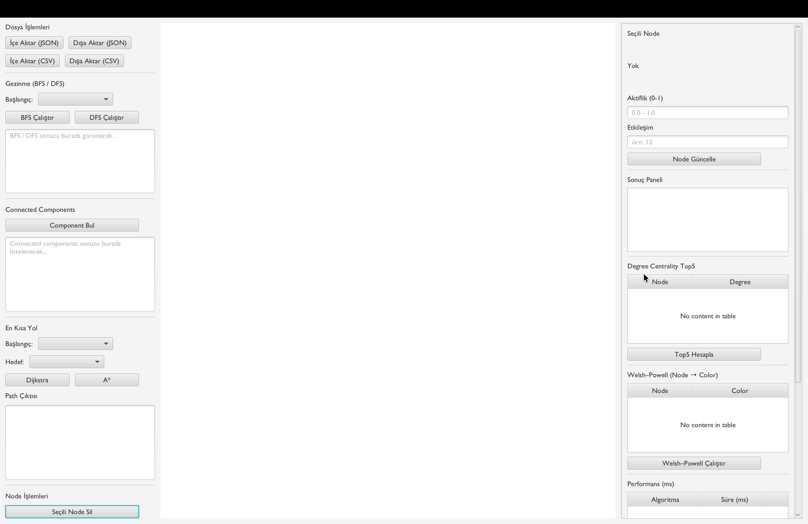

---

**BFS ve DFS algoritmalarına ait gezinme sonuçları:**  
Seçilen başlangıç düğümünden erişilebilen düğümlerin BFS ve DFS algoritmaları ile bulunması sonucu elde edilen gezinme çıktıları sunulmaktadır.

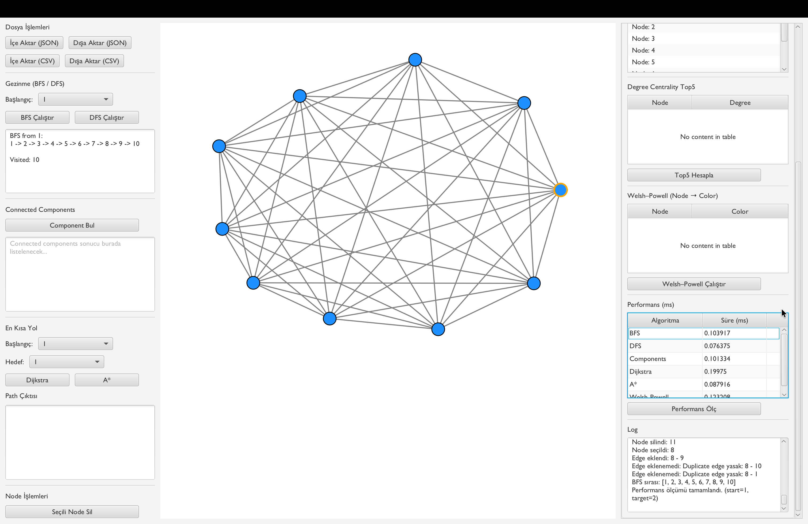

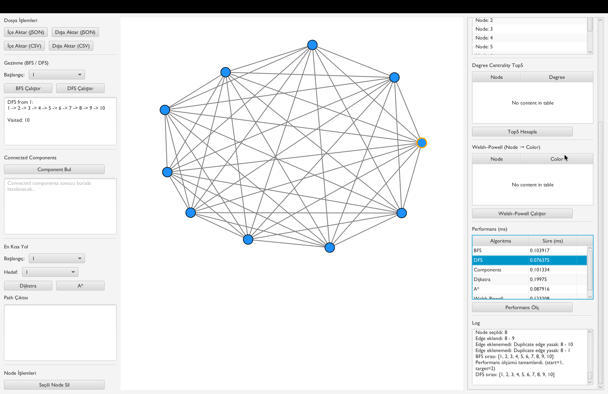

---

**Dijkstra ve A\* algoritmalarına ait en kısa yol çıktıları:**  
İki düğüm arasındaki en kısa yolun, düğüm dizisi ve toplam maliyet bilgisi ile birlikte Dijkstra ve A* algoritmaları kullanılarak hesaplandığı sonuçlar gösterilmektedir.

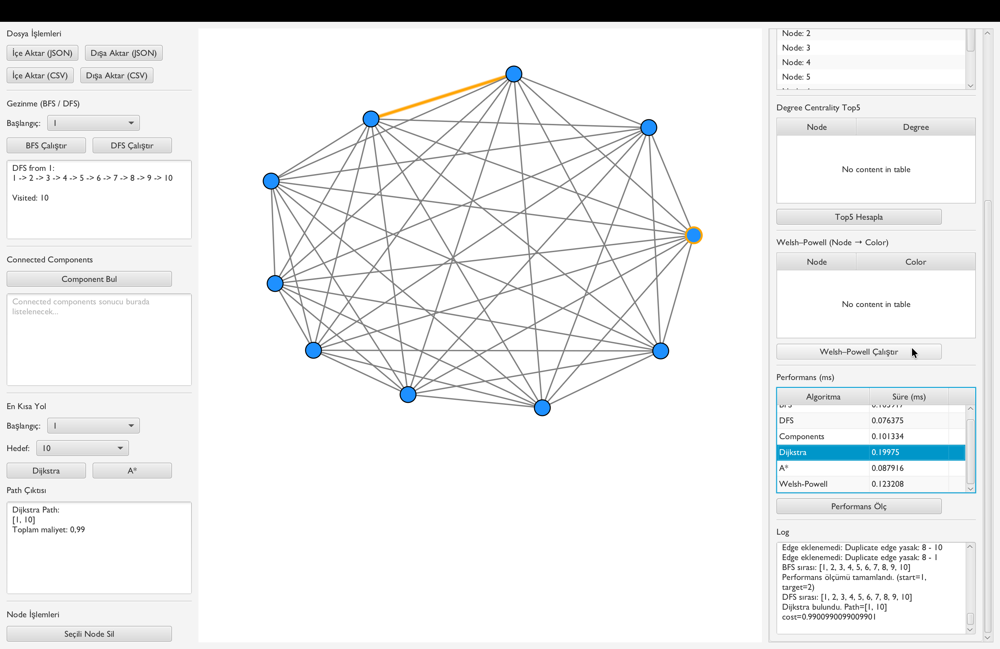

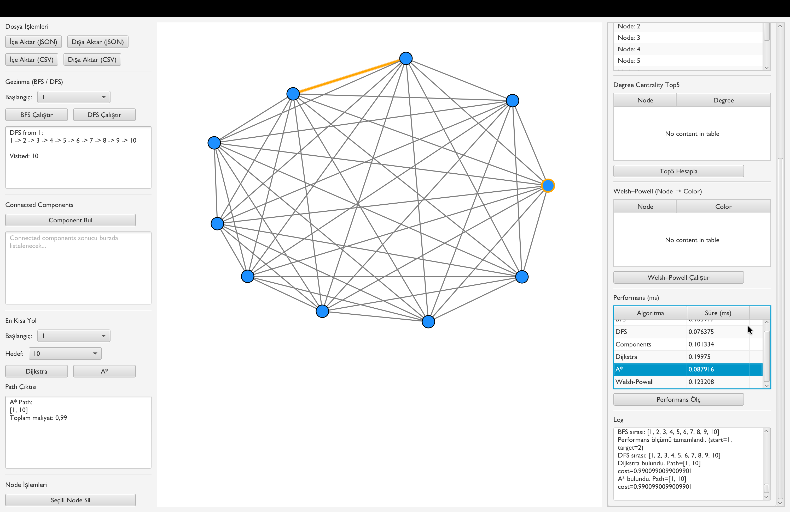

---

**Connected Components sonuçları:**  
Grafın kaç adet bağlı bileşenden oluştuğunu ve her bir bileşenin hangi düğümleri içerdiğini gösteren analiz çıktıları sunulmaktadır.

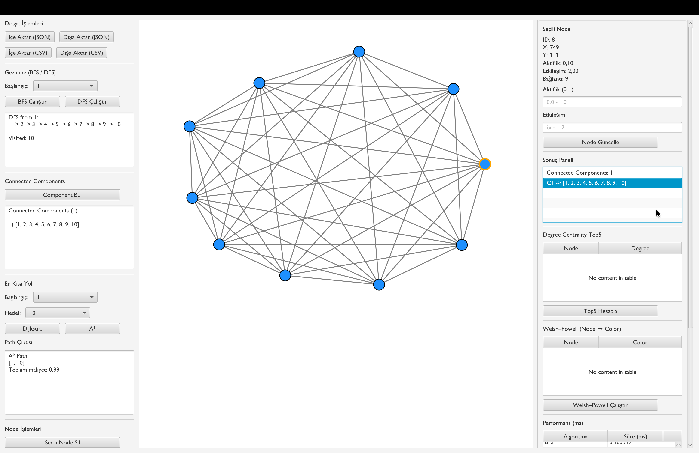

---

**Degree Centrality (Top 5) tablosu:**  
Düğümlerin derece değerlerine göre sıralandığı ve en yüksek dereceye sahip 5 düğümün tablo halinde gösterildiği merkezilik analizi sonuçları yer almaktadır.

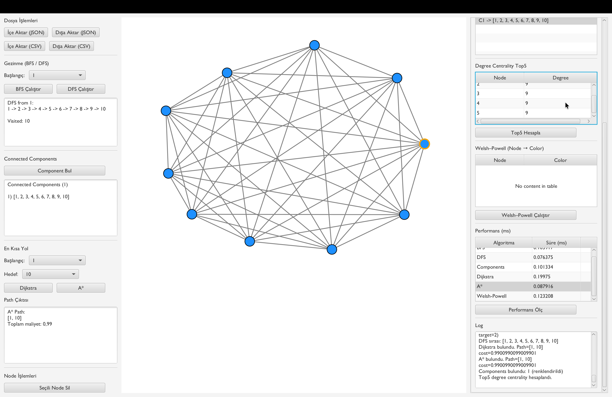

---

**Welsh–Powell graf renklendirme sonuçları:**  
Komşu düğümlerin farklı renklerde boyandığı graf görünümü ve düğüm–renk eşleşmelerini içeren tablo gösterilmektedir.

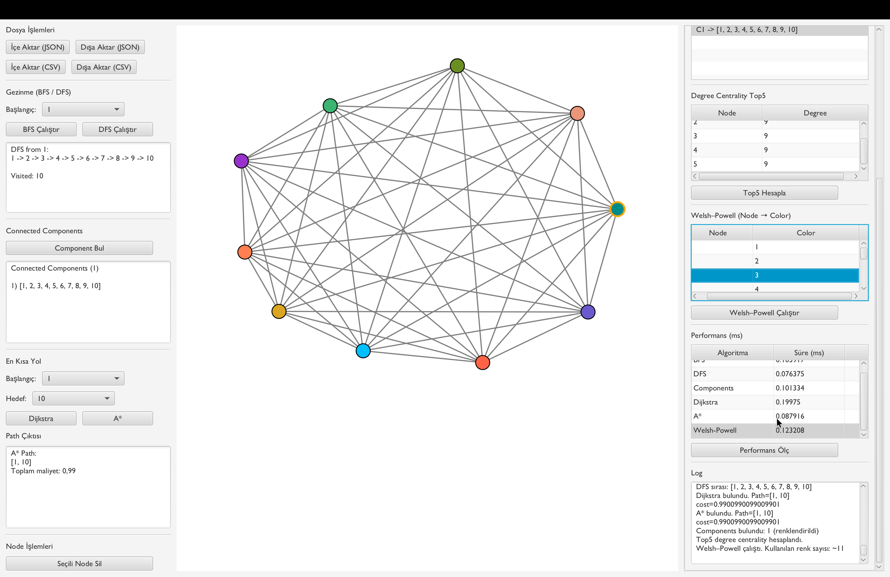

---

**Algoritmaların çalışma sürelerinin yer aldığı Performans (ms) tablosu:**  
BFS, DFS, Dijkstra, A*, Connected Components, Degree Centrality ve Welsh–Powell algoritmalarına ait çalışma sürelerinin milisaniye (ms) cinsinden ölçülerek sunulduğu performans tablosu yer almaktadır.

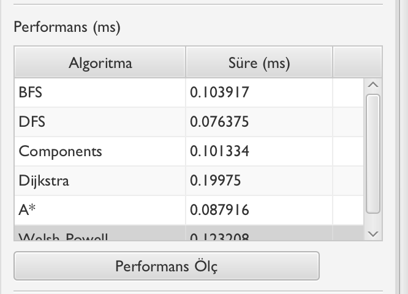

---

**Hatalı veri girişlerine ait uyarı mesajları:**  
Aynı düğümün tekrar eklenmesi veya bir düğümün kendisiyle bağlantı kurulmaya çalışılması (self-loop) gibi hatalı veri girişlerinde sistem tarafından verilen uyarı mesajları gösterilmektedir.


---

### 5.3. Test Senaryoları

İsterlerde belirtildiği üzere testler, farklı boyutlardaki graflar üzerinde gerçekleştirilmiştir.

#### 5.3.1. Test Veri Setleri
- **Küçük ölçekli graf:** 10–20 düğüm içeren veri seti  
- **Orta ölçekli graf:** 50–100 düğüm içeren veri seti  

Her iki veri seti de CSV ve JSON formatlarında hazırlanmış ve uygulamaya içe aktarılmıştır.

---

#### 5.3.2. BFS ve DFS Testleri

Bu testlerde, seçilen bir başlangıç düğümünden erişilebilen tüm düğümlerin bulunması amaçlanmıştır.

**Test Adımları:**
1. Küçük ölçekli graf içe aktarılır.
2. Başlangıç düğümü seçilir.
3. BFS ve DFS algoritmaları ayrı ayrı çalıştırılır.

**Beklenen Sonuç:**
- Erişilebilir tüm düğümlerin sonuç alanında listelenmesi
- Aynı düğümün birden fazla kez listelenmemesi
- Algoritma çalışma sürelerinin performans tablosuna eklenmesi

**Gözlenen Sonuç:**
- BFS ve DFS algoritmaları doğru şekilde çalışmış ve erişilebilir tüm düğümleri listelemiştir.

---

#### 5.3.3. En Kısa Yol Testleri (Dijkstra ve A\*)

Bu testlerde, iki düğüm arasındaki en kısa yolun ve toplam maliyetin hesaplanması amaçlanmıştır.

**Test Adımları:**
1. Başlangıç ve hedef düğümler seçilir.
2. Dijkstra algoritması çalıştırılır.
3. Aynı düğümler için A* algoritması çalıştırılır.

**Beklenen Sonuç:**
- En kısa yolun düğüm dizisi şeklinde gösterilmesi
- Toplam maliyetin hesaplanması
- A* algoritmasının Dijkstra ile benzer maliyetli sonuç üretmesi

**Gözlenen Sonuç:**
- Her iki algoritma da geçerli ve tutarlı en kısa yol sonuçları üretmiştir.

---

#### 5.3.4. Connected Components Testi

Bu test ile grafın kaç adet bağlı bileşenden oluştuğu belirlenmiştir.

**Test Adımları:**
1. Connected Components algoritması çalıştırılır.

**Beklenen Sonuç:**
- Ayrık toplulukların listelenmesi
- Her düğümün yalnızca bir bileşene ait olması

**Gözlenen Sonuç:**
- Grafın bağlı bileşenleri doğru şekilde tespit edilmiştir.

---

#### 5.3.5. Degree Centrality (Top 5) Testi

Bu testte, ağ içerisindeki en etkili kullanıcıların belirlenmesi amaçlanmıştır.

**Test Adımları:**
1. Degree Centrality algoritması çalıştırılır.

**Beklenen Sonuç:**
- Her düğümün derece değerinin hesaplanması
- En yüksek dereceye sahip 5 düğümün tablo halinde gösterilmesi

**Gözlenen Sonuç:**
- En etkili 5 düğüm doğru şekilde belirlenmiştir.

---

#### 5.3.6. Welsh–Powell Graf Renklendirme Testi

Bu test ile komşu düğümlerin farklı renklere boyanması amaçlanmıştır.

**Test Adımları:**
1. Welsh–Powell algoritması çalıştırılır.

**Beklenen Sonuç:**
- Komşu düğümlerin aynı renkte olmaması
- Renklendirme sonuçlarının tablo ve grafik üzerinde gösterilmesi

**Gözlenen Sonuç:**
- Graf başarıyla renklendirilmiş ve görsel ayrım sağlanmıştır.

---

### 5.4. Performans Testleri ve Sonuçlar

İsterlere uygun olarak algoritmaların çalışma süreleri ölçülmüş ve küçük ile orta ölçekli graflar üzerinde karşılaştırılmıştır. Ölçümler, uygulama içerisinde yer alan **Performans (ms)** tablosu kullanılarak gerçekleştirilmiştir.

| Veri Seti | Düğüm Sayısı | BFS (ms) | DFS (ms) | Dijkstra (ms) | A* (ms) | Components (ms) | Centrality (ms) | Welsh–Powell (ms) |
|----------|-------------|----------|----------|---------------|---------|----------------|-----------------|-------------------|
| Küçük    | 15          | 0.004791 | 0.002500 | 0.035125      | 0.049208 | 0.066792       | —               | 0.057041          |
| Orta     | 80          | 0.004917 | 0.002208 | 0.088084      | 0.077667 | 0.338459       | —               | 0.308708          |

Elde edilen sonuçlara göre, tüm algoritmalar orta ölçekli graflar üzerinde dahi **milisaniye mertebesinde** çalışmakta olup, isterlerde belirtilen *“makul sürelerde çalışma”* koşulu sağlanmıştır.
> Not: Connected Components ve Welsh–Powell algoritmalarının diğer algoritmalara göre daha uzun sürede çalışması, grafın tamamını dolaşmaları ve ek kontrol adımları içermeleri nedeniyle beklenen bir durumdur.

---

### 5.5. Hatalı Veri Kontrolleri

Uygulamada hatalı veri girişlerini engellemek amacıyla çeşitli kontroller uygulanmıştır:

- Aynı düğümün tekrar eklenmesi engellenmiştir.
- Bir düğümün kendisiyle bağlantı kurması (self-loop) engellenmiştir.
- Hatalı veri girişlerinde kullanıcıya uyarı mesajları gösterilmiştir.

Bu kontroller sayesinde sistemin kararlı ve güvenilir çalışması sağlanmıştır.

## 6. Sonuç ve Tartışma

Bu bölümde geliştirilen Sosyal Ağ Analizi Uygulaması’nın genel değerlendirmesi yapılmış, elde edilen kazanımlar, karşılaşılan sınırlılıklar ve gelecekte yapılabilecek geliştirmeler tartışılmıştır.

---

### 6.1. Projenin Genel Değerlendirmesi

Bu proje kapsamında, kullanıcılar arasındaki ilişkileri modelleyen ve analiz eden bir Sosyal Ağ Analizi Uygulaması başarıyla geliştirilmiştir. Uygulama, sosyal ağ yapısını ağırlıklı ve yönsüz bir graf olarak ele almış; veri yapıları, graf algoritmaları ve görselleştirme bileşenlerini bütünleşik bir şekilde sunmuştur.

Geliştirilen sistem sayesinde kullanıcılar, sosyal ağ üzerindeki bağlantıları görsel olarak inceleyebilmekte, farklı algoritmaları çalıştırarak ağın yapısı hakkında anlamlı çıkarımlar yapabilmektedir. Proje, teorik graf algoritmalarının pratik bir uygulama üzerinde nasıl kullanılabileceğini göstermesi açısından önemli bir kazanım sağlamıştır.

---

### 6.2. Başarılar

Projede elde edilen başlıca başarılar aşağıda özetlenmiştir:

- Sosyal ağ yapısı, düğüm ve kenarlardan oluşan ağırlıklı bir graf modeli ile başarıyla temsil edilmiştir.
- BFS, DFS, Dijkstra, A*, Connected Components, Degree Centrality ve Welsh–Powell algoritmaları isterlere uygun şekilde gerçeklenmiştir.
- Tüm algoritmalar kullanıcı arayüzü üzerinden ayrı ayrı tetiklenebilir hale getirilmiştir.
- Kenar ağırlıkları, düğümlerin sayısal özelliklerine dayalı olarak dinamik şekilde hesaplanmış ve en kısa yol algoritmalarında etkin biçimde kullanılmıştır.
- Küçük ve orta ölçekli graflar üzerinde algoritmalar test edilmiş, çalışma süreleri ölçülerek performans tablosunda sunulmuştur.
- CSV ve JSON formatlarında veri içe/dışa aktarımı sağlanarak veri kalıcılığı gerçekleştirilmiştir.
- Hatalı veri girişleri (aynı düğümün tekrar eklenmesi, self-loop oluşturulması vb.) sistem tarafından engellenmiştir.
- JavaFX tabanlı grafiksel arayüz ile kullanıcıya etkileşimli ve anlaşılır bir kullanım deneyimi sunulmuştur.

Bu başarılar, projenin işlevsel isterleri ve teknik gereksinimleri büyük ölçüde karşıladığını göstermektedir.

---

### 6.3. Sınırlılıklar

Her ne kadar proje başarıyla tamamlanmış olsa da bazı sınırlılıklar bulunmaktadır:

- Graf boyutu ve kenar yoğunluğu arttıkça algoritmaların çalışma süreleri doğal olarak artmaktadır.
- Welsh–Powell graf renklendirme algoritması, sezgisel (greedy) bir yaklaşım kullandığı için minimum renk sayısını garanti etmemektedir.
- A* algoritmasında kullanılan sezgisel fonksiyonun (heuristic) doğruluğu ve etkinliği, düğümlerin konum bilgilerine bağlıdır.
- Çok büyük ölçekli (1000+ düğüm) graflarda, grafiksel arayüzün çizim performansı sınırlı kalabilir.
- Uygulama, masaüstü tabanlı olduğu için farklı platformlarda (web/mobil) doğrudan çalıştırılamamaktadır.

Bu sınırlılıklar, projenin mevcut kapsamı göz önünde bulundurulduğunda kabul edilebilir düzeydedir.

---

### 6.4. Olası Geliştirmeler

Proje ilerleyen aşamalarda aşağıdaki yönlerde geliştirilebilir:

- Daha büyük ölçekli graflar için algoritma ve çizim performansının optimize edilmesi.
- Degree Centrality dışında betweenness ve closeness gibi farklı merkezilik ölçütlerinin eklenmesi.
- Algoritma sonuçlarının rapor veya CSV dosyası olarak dışa aktarılabilmesi.
- Kullanıcı arayüzüne yakınlaştırma (zoom), sürükleme (pan) ve animasyon gibi etkileşimli özelliklerin eklenmesi.
- Birim testler (JUnit) ile algoritmaların otomatik olarak test edilmesi.
- Web tabanlı bir arayüz geliştirilerek uygulamanın platform bağımsız hale getirilmesi.

Bu geliştirmeler, uygulamanın hem akademik hem de pratik kullanım açısından daha güçlü hale gelmesini sağlayacaktır.

---

### 6.5. Sonuç

Sonuç olarak bu proje, grafik veri yapıları ve graf algoritmalarının sosyal ağ analizi problemlerinde nasıl uygulanabileceğini göstermiştir. Geliştirilen uygulama, hem teorik bilgilerin pratiğe dökülmesini sağlamış hem de kullanıcıya görsel ve etkileşimli bir analiz ortamı sunmuştur. Proje, Yazılım Geliştirme Laboratuvarı dersi kapsamında beklenen öğrenme hedeflerini büyük ölçüde karşılamıştır.
