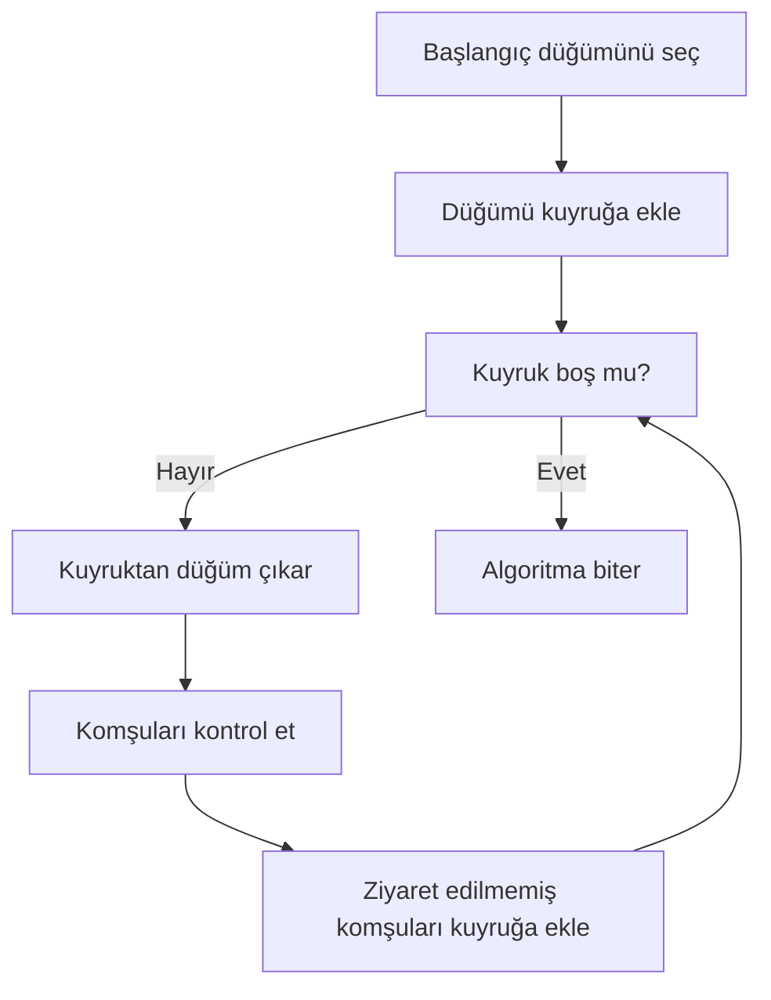
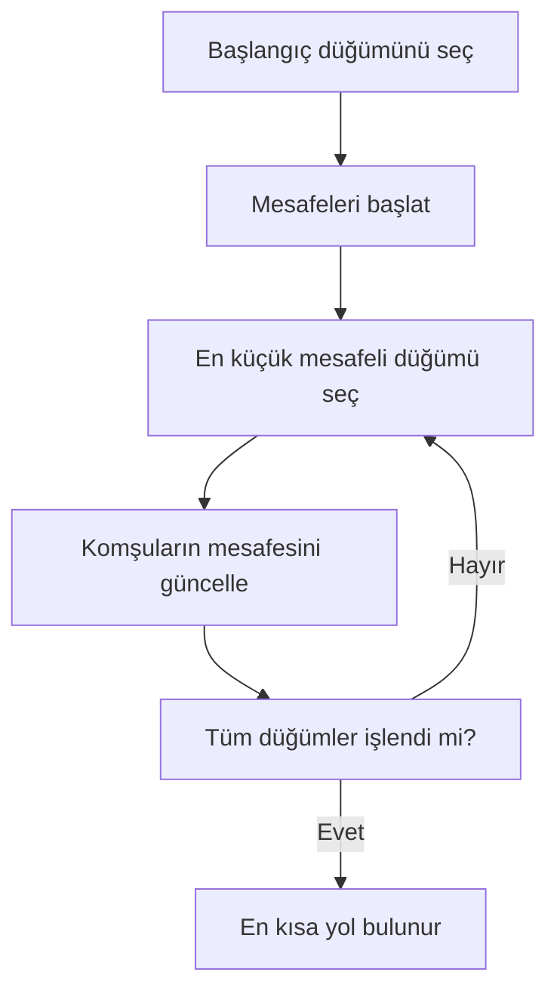
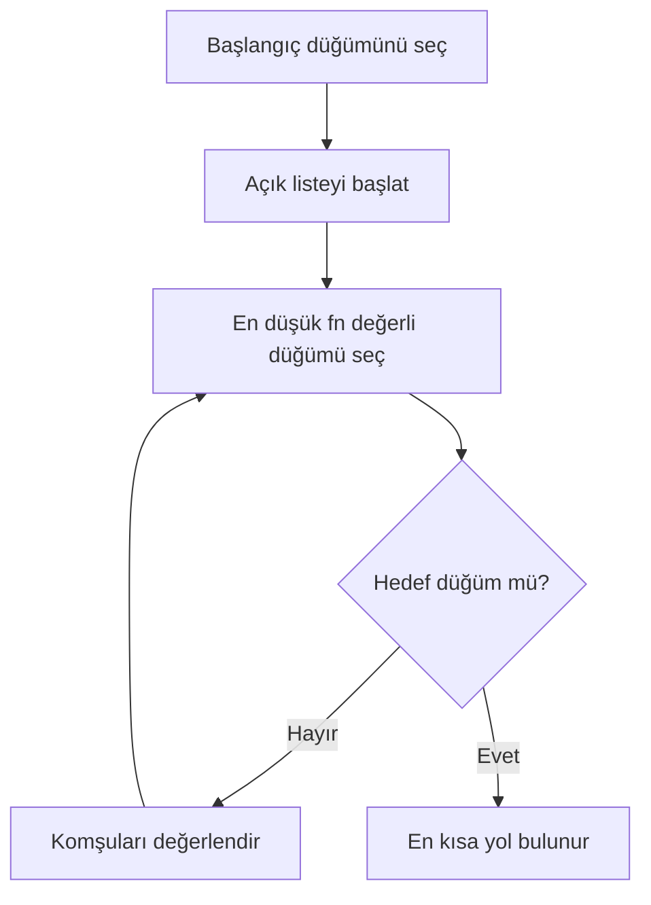
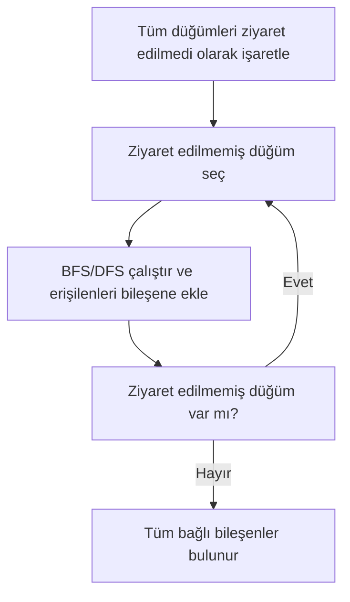
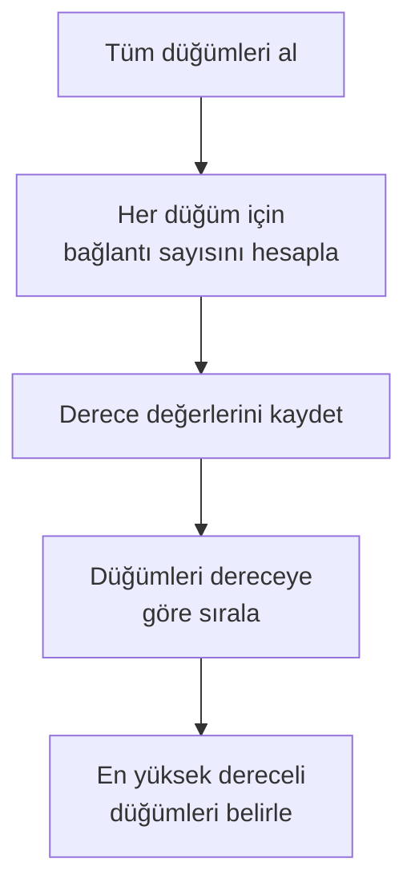
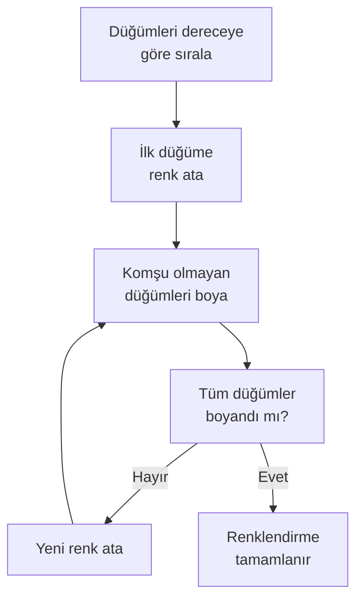

## YazLabProje2
Kocaeli Üniversitesi Teknoloji Fakültesi
Bilişim Sistemleri Mühendisliği
Yazılım Geliştirme Laboratuvarı I – Proje 2

## 1.Proje Bilgileri
Proje Adı: Sosyal Ağ Analizi Uygulaması
Ders: Yazılım Geliştirme Laboratuvarı I
Akademik Yıl: 2025–2026

## Ekip Üyeleri
	•	Şenay Cengiz-231307027
	•	Yasemin Atiş-231307027
## 2. Giriş
Bu proje kapsamında, kullanıcıların düğüm (node) ve aralarındaki ilişkilerin kenar (edge) olarak temsil edildiği bir Sosyal Ağ Analizi Uygulaması geliştirilmiştir. Uygulama, sosyal ağı dinamik olarak oluşturabilmekte, farklı algoritmalar yardımıyla ağ üzerinde analizler yapabilmekte ve sonuçları görsel olarak sunabilmektedir.

 Projenin Amaçları

Bu projenin temel amaçları şunlardır:
	•	Sosyal ağ yapısının graf veri yapısı ile modellenmesi
	•	BFS, DFS, Dijkstra, A*, bağlı bileşenler ve merkezilik gibi graf algoritmalarının uygulanması
	•	Dinamik ağırlık hesaplama yöntemiyle gerçekçi kenar maliyetlerinin oluşturulması
	•	Welsh–Powell algoritması ile graf renklendirme yapılarak toplulukların görselleştirilmesi
	•	Nesne yönelimli tasarım prensiplerine uygun, modüler ve sürdürülebilir bir yazılım geliştirilmesi
	•	Algoritma sonuçlarının tablo, renk ve görsel grafikler ile kullanıcıya sunulması

Bu proje sayesinde grafik yapıları, algoritma analizi, nesne yönelimli programlama ve görselleştirme konularında uygulamalı deneyim kazanılması hedeflenmiştir.
## 3. Gerçeklenen Algoritmalar 

Bu projede sosyal ağ yapısının analiz edilebilmesi amacıyla çeşitli grafik algoritmaları
gerçeklenmiştir. Aşağıdaki tabloda, uygulamada kullanılan algoritmalar, kullanım amaçları
ve zaman karmaşıklıkları özetlenmiştir.

| Algoritma | Kullanım Amacı | Zaman Karmaşıklığı |
|----------|---------------|-------------------|
| BFS (Breadth First Search) | Bir düğümden erişilebilen tüm düğümlerin seviye seviye bulunması | O(V + E) |
| DFS (Depth First Search) | Grafın derinlemesine gezilerek erişilebilir düğümlerin tespiti | O(V + E) |
| Dijkstra | Kenar ağırlıklarını dikkate alarak iki düğüm arasındaki en kısa yolun bulunması | O((V + E) log V) |
| A* (A-Star) | Sezgisel yaklaşım ile en kısa yolun daha hızlı hesaplanması | O((V + E) log V) |
| Bağlı Bileşenler | Grafın kaç ayrı alt topluluktan oluştuğunun tespit edilmesi | O(V + E) |
| Degree Centrality | En yüksek dereceye sahip (en etkili) düğümlerin belirlenmesi | O(V) |
| Welsh–Powell | Komşu düğümlerin farklı renklerle boyanmasını sağlayan graf renklendirme | O(V²) |

## 3.1. Breadth First Search (BFS)

Amaç

Breadth First Search (BFS) algoritması, graf üzerinde seçilen bir başlangıç düğümünden itibaren erişilebilen tüm düğümlerin seviye seviye tespit edilmesi amacıyla kullanılmıştır. Sosyal ağ bağlamında BFS, bir kullanıcının doğrudan ve dolaylı olarak bağlantılı olduğu tüm kullanıcıları belirlemek için uygulanmıştır.

⸻

Çalışma Mantığı

BFS algoritması, grafı katmanlar halinde dolaşır ve bu işlem sırasında kuyruk (queue) veri yapısını kullanır.

Algoritmanın temel adımları şu şekildedir:  

	1.	Başlangıç düğümü seçilir ve kuyruğa eklenir.
	2.	Düğüm ziyaret edildi olarak işaretlenir.
	3.	Kuyruktan çıkarılan düğümün tüm komşuları kontrol edilir.
	4.	Daha önce ziyaret edilmemiş komşular kuyruğa eklenir.
	5.	Kuyruk boşalana kadar işlem devam eder.

Bu yöntem sayesinde graf, başlangıç düğümüne olan en kısa adım mesafesine göre gezilmiş olur.

Zaman Karmaşıklığı
	•	Zaman Karmaşıklığı:
O(V + E)

Burada:
	•	V: Graf üzerindeki düğüm sayısı
	•	E: Graf üzerindeki kenar sayısı

BFS algoritması, her düğümü ve kenarı en fazla bir kez ziyaret ettiği için verimli bir algoritmadır.

⸻

Projede Kullanımı

Bu projede BFS algoritması:  

	•	Kullanıcı tarafından seçilen bir düğümden başlanarak,  
  
	•	Erişilebilen tüm kullanıcıların tespit edilmesi,   
  
	•	Sonuçların liste ve tablo formatında gösterilmesi
amacıyla kullanılmıştır. Ayrıca algoritmanın çalışma süresi ölçülerek performans analizlerinde değerlendirilmiştir.

## 3.2. Depth First Search (DFS)

Amaç

Depth First Search (DFS) algoritması, graf üzerinde seçilen bir başlangıç düğümünden
itibaren derinlemesine ilerleyerek erişilebilir tüm düğümlerin tespit edilmesi
amacıyla kullanılmıştır. DFS, sosyal ağ yapısının daha ayrıntılı biçimde keşfedilmesini
sağlamaktadır.

⸻

Çalışma Mantığı

DFS algoritması, bir düğümden başlayarak mümkün olduğunca derinlere inmeyi
hedefler. Bir yol tamamen gezildikten sonra geri dönülerek diğer yollar keşfedilir.
Bu algoritma, yığın (stack) yapısı veya özyineleme (recursive) yaklaşımı ile
gerçekleştirilebilir.

Algoritmanın temel adımları şu şekildedir:  

	1.	Başlangıç düğümü seçilir ve ziyaret edildi olarak işaretlenir.
	2.	Düğümün ziyaret edilmemiş bir komşusu varsa bu düğüme geçilir.
	3.	Bu işlem, ziyaret edilecek komşu kalmayana kadar devam eder.
	4.	Ziyaret edilecek düğüm kalmadığında algoritma sonlanır.

  ```mermaid
flowchart TD
    A[Başlangıç düğümünü seç] --> B[Düğümü ziyaret edildi olarak işaretle]
    B --> C[Ziyaret edilmemiş komşu var mı?]
    C -- Evet --> D[Komşu düğüme git]
    D --> B
    C -- Hayır --> E[Geri dön / Algoritma biter]
```
Zaman Karmaşıklığı
	•	Zaman Karmaşıklığı: O(V + E)

Burada:
	•	V: Graf üzerindeki düğüm sayısı
	•	E: Graf üzerindeki kenar sayısı

DFS algoritması da BFS gibi her düğümü ve kenarı en fazla bir kez ziyaret etmektedir.

⸻

Projede Kullanımı

Bu projede DFS algoritması:  

	•	Seçilen bir düğümden erişilebilen kullanıcıların tespit edilmesi,
	•	Graf yapısının derinlemesine analiz edilmesi,
	•	BFS algoritması ile karşılaştırmalı sonuçlar elde edilmesi

amacıyla kullanılmıştır. 
 ## 3.3. Dijkstra Algoritması

### Amaç

Dijkstra algoritması, graf üzerindeki **kenar ağırlıklarını dikkate alarak**
iki düğüm arasındaki **en kısa yolun bulunması** amacıyla kullanılmıştır.
Sosyal ağ bağlamında bu algoritma, kullanıcılar arasındaki en düşük maliyetli
(etkileşim, benzerlik vb.) bağlantı yolunun hesaplanmasını sağlar.

---

### Çalışma Mantığı

Dijkstra algoritması, başlangıç düğümünden itibaren tüm düğümlere olan
en kısa mesafeleri kademeli olarak hesaplar. Algoritma, her adımda
henüz işlenmemiş düğümler arasından **en küçük geçici mesafeye sahip**
olan düğümü seçer ve bu düğüm üzerinden komşuların mesafelerini günceller.

Bu projede Dijkstra algoritması şu adımlar ile uygulanmıştır:

1. Başlangıç düğümünün mesafesi 0 olarak atanır, diğer düğümlerin mesafesi sonsuz kabul edilir.
2. En küçük mesafeye sahip düğüm seçilir.
3. Seçilen düğümün komşuları için yeni mesafe değerleri hesaplanır.
4. Daha kısa bir yol bulunursa mesafe güncellenir.
5. Tüm düğümler işlenene veya hedef düğüme ulaşılana kadar işlem devam eder.

---

### Akış Diyagramı (Mermaid)


Zaman Karmaşıklığı
	•	Zaman Karmaşıklığı: O((V + E) log V) 
  
Öncelik kuyruğu (priority queue) kullanılması sayesinde algoritma,
orta ölçekli graflarda makul sürelerde çalışmaktadır.

⸻

Projede Kullanımı

Bu projede Dijkstra algoritması:  

	•	Kullanıcı tarafından seçilen iki düğüm arasındaki en kısa yolun bulunması,
	•	Kenar maliyetlerinin dinamik ağırlık hesaplama formülü ile belirlenmesi,
	•	Elde edilen yolun görsel olarak vurgulanması ve tablo halinde sunulması

amacıyla kullanılmıştır.
## 3.4. A* (A-Star) Algoritması

### Amaç

A* (A-Star) algoritması, iki düğüm arasındaki **en kısa yolun daha verimli
şekilde bulunması** amacıyla kullanılmıştır. A* algoritması, Dijkstra
algoritmasına ek olarak hedef düğüme olan **tahmini uzaklığı (heuristic)**
da dikkate alarak arama sürecini yönlendirir.

Bu sayede özellikle orta ölçekli graflarda daha hızlı sonuçlar elde edilmesi
amaçlanmıştır.

---

### Çalışma Mantığı

A* algoritması, her düğüm için iki değeri birlikte değerlendirir:

- **g(n):** Başlangıç düğümünden mevcut düğüme kadar olan gerçek maliyet  
- **h(n):** Mevcut düğümden hedef düğüme olan tahmini maliyet (heuristic)

Toplam maliyet şu şekilde hesaplanır:  
f(n) = g(n) + h(n)
Algoritmanın temel adımları şu şekildedir:

1. Başlangıç düğümü açık listeye eklenir.
2. Açık listedeki en düşük f(n) değerine sahip düğüm seçilir.
3. Seçilen düğümün komşuları değerlendirilir.
4. Daha düşük maliyetli bir yol bulunursa düğüm bilgileri güncellenir.
5. Hedef düğüme ulaşıldığında algoritma sonlanır.

---

### Akış Diyagramı (Mermaid)


Zaman Karmaşıklığı
	•	Zaman Karmaşıklığı: O((V + E) log V)

A* algoritmasının karmaşıklığı kullanılan heuristic fonksiyonun
başarısına bağlıdır. Uygun bir heuristic seçildiğinde,
Dijkstra algoritmasına göre daha az düğüm ziyaret edilir.

⸻

Projede Kullanımı

Bu projede A* algoritması:  

	•	İki kullanıcı arasındaki en kısa yolun bulunması,
	•	Dinamik olarak hesaplanan kenar ağırlıkları ile çalışılması,
	•	Dijkstra algoritması ile performans karşılaştırması yapılması
amacıyla kullanılmıştır.

## 3.5. Bağlı Bileşenler (Connected Components)

### Amaç

Bağlı bileşenler analizi, grafın **kaç ayrı parçadan (alt topluluktan)** oluştuğunu
tespit etmek amacıyla kullanılmıştır. Sosyal ağ bağlamında bu yöntem, birbiriyle
bağlantılı kullanıcı gruplarını (toplulukları) ve ağdan kopuk yapıdaki kullanıcı
kümelerini ortaya çıkarmayı sağlar.

---

### Çalışma Mantığı

Bağlı bileşenleri bulmak için graf üzerinde dolaşma yapılır. Temel yaklaşım:

1. Tüm düğümler "ziyaret edilmedi" olarak işaretlenir.
2. Ziyaret edilmemiş bir düğüm seçilir ve bu düğümden BFS/DFS başlatılır.
3. Dolaşma sırasında erişilen tüm düğümler **aynı bileşene** atanır.
4. Graf üzerinde ziyaret edilmemiş düğüm kalmayana kadar işlem tekrarlanır.
5. Elde edilen her grup, grafın bir bağlı bileşenini temsil eder.

Bu projede bağlı bileşen bulma işleminde BFS/DFS yaklaşımı kullanılarak
bileşenler tespit edilmiştir.

---

### Akış Diyagramı (Mermaid)


Zaman Karmaşıklığı
	•	Zaman Karmaşıklığı: O(V + E)

Her düğüm ve kenar en fazla bir kez ziyaret edildiğinden bağlı bileşenlerin
bulunması verimli bir şekilde gerçekleştirilmektedir.

⸻

Projede Kullanımı

Bu projede bağlı bileşenler:
	•	Sosyal ağın kaç ayrı topluluktan oluştuğunun belirlenmesi,
	•	Her bileşenin görsel olarak ayrıştırılması (renk/etiket),
	•	Ayrık toplulukların kullanıcıya raporlanması

amacıyla kullanılmıştır.
## 3.6. Degree Centrality (Derece Merkeziliği)

### Amaç

Degree Centrality, her düğümün sahip olduğu bağlantı (kenar) sayısını
hesaplayarak **en etkili kullanıcıların** belirlenmesi amacıyla kullanılmıştır.
Sosyal ağ bağlamında, daha fazla bağlantıya sahip kullanıcıların ağ üzerinde
daha merkezi bir rol oynadığı kabul edilir.

---

### Çalışma Mantığı

Degree Centrality hesaplaması şu adımlarla gerçekleştirilir:

1. Graf üzerindeki her düğüm için bağlantı sayısı (derece) hesaplanır.
2. Hesaplanan derece değerleri saklanır.
3. Düğümler derece değerlerine göre sıralanır.
4. En yüksek dereceye sahip düğümler (ilk 5) belirlenir.

Bu yöntem, ağırlık veya yol hesabı yapmadan doğrudan bağlantı yoğunluğunu
ölçmeye dayanır.

---

### Akış Diyagramı (Mermaid)


Zaman Karmaşıklığı
	•	Zaman Karmaşıklığı: O(V)

Burada:
	•	V: Düğüm sayısı

Her düğümün derecesi tek bir geçişte hesaplandığı için algoritma oldukça
verimli çalışmaktadır.

⸻

Projede Kullanımı

Bu projede Degree Centrality:  

	•	Her kullanıcının derece değerinin hesaplanması,
	•	En yüksek dereceye sahip ilk 5 kullanıcının tablo halinde gösterilmesi,
	•	Sosyal ağdaki en etkili kullanıcıların belirlenmesi
amacıyla kullanılmıştır.

## 3.7. Welsh–Powell Graf Renklendirme Algoritması

### Amaç

Welsh–Powell algoritması, graf üzerindeki **komşu düğümlerin farklı
renklerle boyanmasını** sağlamak amacıyla kullanılmıştır. Bu algoritma,
özellikle ayrık toplulukların görsel olarak ayırt edilmesini kolaylaştırır.

---

### Çalışma Mantığı

Welsh–Powell algoritmasının temel çalışma adımları şu şekildedir:

1. Tüm düğümler derece değerlerine göre azalan sırada dizilir.
2. İlk düğüme ilk renk atanır.
3. Komşu olmayan düğümlere aynı renk atanır.
4. Boyanamayan düğümler için yeni renkler kullanılır.
5. Tüm düğümler renklendirilene kadar işlem devam eder.

Bu yaklaşım, grafın minimum renk sayısına yakın bir çözüm üretmeyi hedefler.

---

### Akış Diyagramı (Mermaid)


Zaman Karmaşıklığı
	•	Zaman Karmaşıklığı: O(V²)

Burada:
	•	V: Düğüm sayısı

Düğümler arası komşuluk kontrolleri nedeniyle algoritmanın karmaşıklığı
kare mertebesindedir.

⸻

Projede Kullanımı

Bu projede Welsh–Powell algoritması:  

	•	Ayrık toplulukların farklı renklerle görselleştirilmesi,
	•	Komşu düğümlerin aynı renge boyanmasının engellenmesi,
	•	Renklendirme sonuçlarının tablo ve grafik olarak sunulması

amacıyla kullanılmıştır.
